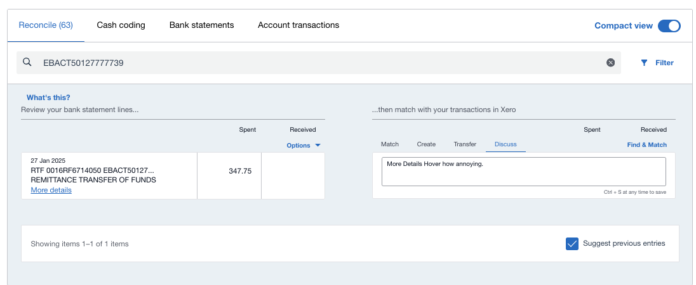
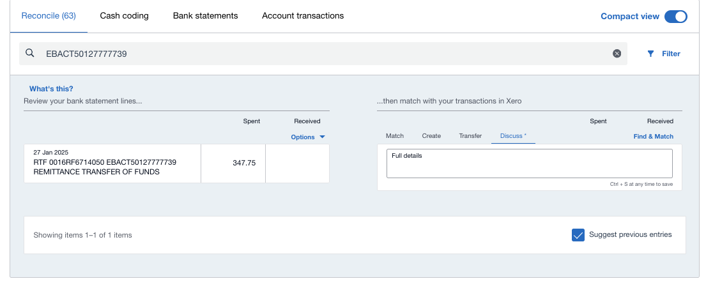

# Xero — Full Statement Details

A tiny Chrome extension for the Xero bank **Reconcile** screen.

Xero shows only a truncated statement description on each line:

```
TRF IB:XXXX0000-0 FT250101A...
```

and hides the rest behind the **More details** popup, which you have to click
open for every single line. This puts the full description on the row
permanently, so line-by-line reconciling needs no clicking.

```
TRF IB:XXXX0000-0 FT250101AB12345678 EXAMPLE PAYER NAME
```

### Before — truncated, with a *More details* link to click



### After — full description on the row



*(This shot was taken from an earlier build that also hid the **More details**
link. Current versions leave the link in place.)*

## Two versions — pick one

| | `css-only/` | `with-js/` |
|---|---|---|
| JavaScript | none | one content script |
| Text is selectable / copyable | **no** | **yes** |
| Survives Xero re-rendering rows | yes | yes (MutationObserver) |

Both read the complete string out of the `title` attribute that Xero already
puts on the row — that attribute is what makes the hover tooltip appear.

- **`css-only/`** hides the truncated text and paints `attr(title)` in its place
  via `::after`. Because that is CSS *generated content*, the browser will not
  let you highlight it. Display only.
- **`with-js/`** writes the full string into the row's existing text node, so it
  behaves like ordinary page text and can be copied. It mutates `nodeValue` in
  place rather than replacing DOM nodes, so React keeps its node reference and
  never fights the change or throws during reconciliation.

Install `with-js/` unless you specifically want a zero-JavaScript extension.

## Install

1. `chrome://extensions` → turn on **Developer mode** (top right).
2. **Load unpacked** → select either `css-only/` or `with-js/`.
3. Reload the Xero tab.

Keep the folder where it is — Chrome reads it from that path on every launch.
After editing a file, hit the ↻ icon on the extension card; no reinstall needed.

Do not install both at once; the CSS rules conflict.

## Scope

- Runs only on `https://*.xero.com/*`.
- Requests no permissions: no tabs, history, storage, or network access.
- Reads and restyles what is already rendered on screen. It never writes to
  Xero, submits anything, or sends data anywhere.

## What it does not cover

The **More details** popup also holds Payee, Reference, Transaction Type and
Cheque No. Those are not present on the row — Xero fetches them on click — so
CSS and DOM tricks cannot surface them. Only the description is covered.

The **More details** button is therefore left in place in both versions, as the
only route to those fields. To hide it anyway, uncomment this rule at the
bottom of `style.css`:

```css
[data-testid="more-details"] { display: none !important; }
```

## Fragility

Selectors depend on Xero's `data-testid` attributes (`line-details`, `notes`,
`more-details`). Those are stabler than Xero's generated class names
(`ext-gen15293`, `xui-button-…`), but Xero can still change them in a release,
at which point the rows simply go back to normal and the extension needs new
selectors.
